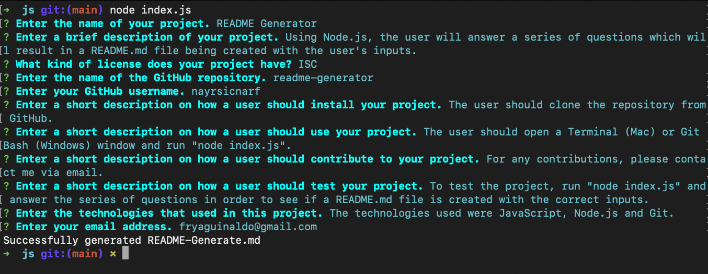
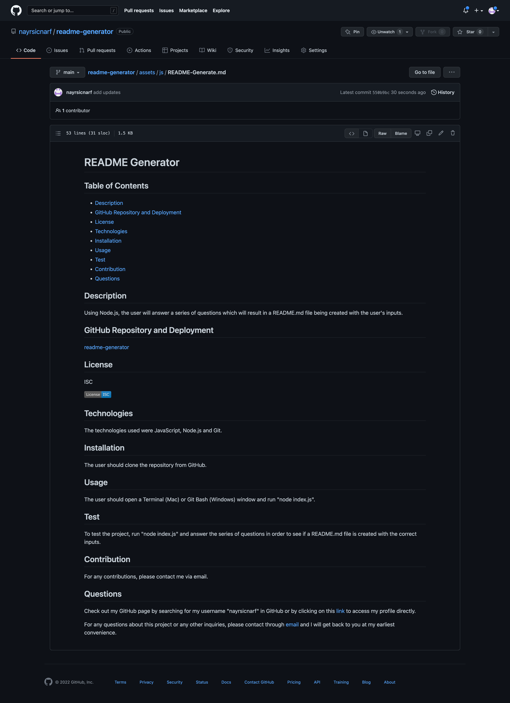

# README Generator

## Table of Contents

- [README Generator](#readme-generator)
  - [Table of Contents](#table-of-contents)
  - [Description](#description)
  - [GitHub Repository and Video Demo](#github-repository-and-video-demo)
  - [Technologies](#technologies)
  - [Installation](#installation)
  - [Usage](#usage)
  - [Screenshot](#screenshot)
  - [Credits](#credits)

## Description

The goal of this assignment is to use Node.js to create a README.md file. This is done by the user answering a series of questions in the command line which will output a professional README based off the user's inputs.

## GitHub Repository and Video Demo

- [GitHub Repository](https://github.com/nayrsicnarf/readme-generator.git)

- [Video Demonstration](https://drive.google.com/drive/folders/1gbTytcXoeqeNT_O6-ym3n48N7GQVcvof?usp=sharing)

## Technologies

- [JavaScript](https://www.w3schools.com/js/)
- [Node.js](https://nodejs.org/en/docs/)
- [Git](https://git-scm.com/doc)

## Installation

To view this webpage on a local machine, pull the code from [GitHub](https://github.com/nayrsicnarf/readme-generator.git) using Terminal (Mac) or Git (Windows) and use the following (or similar) programs:

- Operating System: macOS Monterey Version 21.1
- Visual Studio Code: Version 1.64.2
- Google Chrome: Version 98.0.4758.102
- Terminal: Version 2.12

## Usage

To view the completed project, visit my [GitHub](https://github.com/nayrsicnarf/readme-generator.git) or refer to the [Installation](#installation) section of this README.

## Screenshot

## Credits

This was the tenth homework assignment as part of the [University of Washington Coding Boot Camp](https://bootcamp.uw.edu/coding/). Some of the information used to complete this project was provided by the instructors of this Boot Camp. But other information were obtained, but not limited to, through the following resources:

- [Google](https://www.google.com/)
- [W3Schools Online Web Tutorials](https://www.w3schools.com/)
- [JavaScript Tutorial](https://www.javascripttutorial.net/)
- [License Badges](https://gist.github.com/lukas-h/2a5d00690736b4c3a7ba)